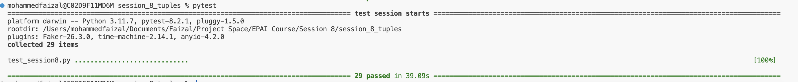

## Introduction

This assignment focuses on:

- Understanding Named Tuples
- Using the Faker Library to generate random data for testing
- Comparing the performance of NamedTuples vs Dictionary implementations

### There are 23 tests excluding readme_exists, readme_500_words, readme_proper_description, readme_file_for_more_than_10_hashes, indentations, function_name_had_cap_letter


---
## Task 1: NamedTuple Implementation

### Profile

A named tuple representing a profile with the following fields:
- `blood_type`: Blood type of the person.
- `latitude`: Latitude of the current location.
- `longitude`: Longitude of the current location.
- `age`: Age of the person.


### `generate_profiles_namedtuple(n: int) -> tuple`

Generates `n` profiles using namedtuples.

```python
def generate_profiles_namedtuple(n: int) -> tuple:
    profiles = []
    append = profiles.append
    for _ in range(n):
        profile = fake.profile()
        birthdate = profile['birthdate']
        append(Profile(
            blood_type=profile['blood_group'],
            latitude=profile['current_location'][0],
            longitude=profile['current_location'][1],
            age=date.today().year - birthdate.year
        ))
    return tuple(profiles)
```

### `largest_blood_type_namedtuple(profiles: Tuple) -> Optional[str]`

Returns the blood type with the highest frequency.

```python
def largest_blood_type_namedtuple(profiles: Tuple) -> Optional[str]:
    if not profiles:
        return None  
    blood_type_counts = Counter(profile.blood_type for profile in profiles)
    return blood_type_counts.most_common(1)[0][0]
```

### `mean_current_location_namedtuple(profiles: Tuple) -> Tuple[float, float]`

Returns the mean latitude and longitude.

```python
def mean_current_location_namedtuple(profiles: Tuple) -> Tuple[float, float]:
    total_lat = sum(profile.latitude for profile in profiles)
    total_long = sum(profile.longitude for profile in profiles)
    count = len(profiles)
    return (float(total_lat / count), float(total_long / count))
```

### `oldest_person_age_namedtuple(ages: Tuple[int, ...]) -> int`

Returns the age of the oldest person.

```python
def oldest_person_age_namedtuple(ages: Tuple[int, ...]) -> int:
    return int(max(ages))
```

### `average_age_namedtuple(ages: Tuple[int, ...]) -> float`

Returns the average age.

```python
def average_age_namedtuple(ages: Tuple[int, ...]) -> float:
    return round(sum(ages) / len(ages), 2)
```

## Tests for Named Tuple Functions

### `test_generate_profiles_namedtuple`

Generates profiles and checks the length and type.

```python
def test_generate_profiles_namedtuple():
    profiles = generate_profiles_namedtuple(10)
    assert len(profiles) == 10
    assert isinstance(profiles[0], Profile)
    assert isinstance(profiles[0].age, int)
```

### `test_largest_blood_type_namedtuple`

Checks the blood type with the highest frequency.

```python
def test_largest_blood_type_namedtuple():
    profiles = generate_profiles_namedtuple(10)
    assert largest_blood_type_namedtuple(profiles) in [profile.blood_type for profile in profiles]
```

### `test_mean_current_location_namedtuple`

Checks the mean latitude and longitude values.

```python
def test_mean_current_location_namedtuple():
    profiles = generate_profiles_namedtuple(10)
    mean_lat, mean_long = mean_current_location_namedtuple(profiles)
    assert isinstance(mean_lat, float)
    assert isinstance(mean_long, float)
```

### `test_oldest_person_age_namedtuple`

Checks the age of the oldest person.

```python
def test_oldest_person_age_namedtuple():
    profiles = generate_profiles_namedtuple(10)
    ages = tuple(profile.age for profile in profiles)
    assert oldest_person_age_namedtuple(ages) == max(ages)
```

### `test_average_age_namedtuple`

Checks the average age calculation.

```python
def test_average_age_namedtuple():
    profiles = generate_profiles_namedtuple(10)
    ages = tuple(profile.age for profile in profiles)
    assert average_age_namedtuple(ages) == round(sum(ages) / len(ages), 2)
```

## Task 2: Dictionaries Implementation

### `generate_profiles_dict(n: int) -> List[Dict]`

Generates `n` profiles using dictionaries.

```python
def generate_profiles_dict(n: int) -> List[Dict]:
    profiles = []
    append = profiles.append 
    for _ in range(n):
        profile = fake.profile()
        birthdate = profile['birthdate']
        append({
            'blood_type': profile['blood_group'],
            'latitude': profile['current_location'][0],
            'longitude': profile['current_location'][1],
            'age': date.today().year - birthdate.year
        })
    return profiles
```

### `largest_blood_type_dict(profiles: List[Dict]) -> str`

Returns the blood type with the highest frequency using dictionaries.

```python
def largest_blood_type_dict(profiles: List[Dict]) -> str:
    blood_type_counts = {}
    for profile in profiles:
        blood_type = profile['blood_type']
        blood_type_counts[blood_type] = blood_type_counts.get(blood_type, 0) + 1
    return max(blood_type_counts, key=blood_type_counts.get)
```

### `mean_current_location_dict(profiles: List[Dict]) -> Tuple[float, float]`

Returns the mean latitude and longitude using dictionaries.

```python
def mean_current_location_dict(profiles: List[Dict]) -> Tuple[float, float]:
    latitude_sum = 0
    longitude_sum = 0
    count = len(profiles)
    for profile in profiles:
        latitude_sum += profile['latitude']
        longitude_sum += profile['longitude']
    return (float(latitude_sum / count), float(longitude_sum / count))
```

### `oldest_person_age_dict(profiles: List[Dict]) -> int`

Returns the age of the oldest person using dictionaries.

```python
def oldest_person_age_dict(profiles: List[Dict]) -> int:
    return max(profile['age'] for profile in profiles)
```

### `average_age_dict(profiles: List[Dict]) -> float`

Returns the average age using dictionaries.

```python
def average_age_dict(profiles: List[Dict]) -> float:
    age_sum = sum(profile['age'] for profile in profiles)
    return round(age_sum / len(profiles), 2)
```

## Tests for Dictionary Functions

### `test_generate_profiles_dict`

Generates profiles and checks the length and type.

```python
def test_generate_profiles_dict():
    profiles = generate_profiles_dict(10)
    assert len(profiles) == 10
    assert isinstance(profiles[0], dict)
    assert 'age' in profiles[0]
```

### `test_largest_blood_type_dict`

Checks the blood type with the highest frequency.

```python
def test_largest_blood_type_dict():
    profiles = generate_profiles_dict(10)
    assert largest_blood_type_dict(profiles) in [profile['blood_type'] for profile in profiles]
```

### `test_mean_current_location_dict`

Checks the mean latitude and longitude values.

```python
def test_mean_current_location_dict():
    profiles = generate_profiles_dict(10)
    mean_lat, mean_long = mean_current_location_dict(profiles)
    assert isinstance(mean_lat, float)
    assert isinstance(mean_long, float)
```

### `test_oldest_person_age_dict`

Checks the age of the oldest person.

```python
def test_oldest_person_age_dict():
    profiles = generate_profiles_dict(10)
    assert oldest_person_age_dict(profiles) == max(profile['age'] for profile in profiles)
```

### `test_average_age_dict`

Checks the average age calculation.

```python
def test_average_age_dict():
    profiles = generate_profiles_dict(10)
    assert average_age_dict(profiles) == round(sum(profile['age'] for profile in profiles) / len(profiles), 2)
```

## Performance Comparison

### `compare_performance(n: int) -> None`

Compares the performance of metric calculations using namedtuples vs dictionaries.

```python
def compare_performance(n: int) -> None:
    profiles_tuples = generate_profiles_namedtuple(n)
    ages_tuple = tuple(profile.age for profile in profiles_tuples)
    start = perf_counter()
    largest_blood_type_namedtuple(profiles_tuples)
    mean_current_location_namedtuple(profiles_tuples)
    oldest_person_age_namedtuple(ages_tuple)
    average_age_namedtuple(ages_tuple)
    end = perf_counter()
    total_elapsed_named_tuple = end - start
    profiles_dict = generate_profiles_dict(n)
    start = perf_counter()
    largest_blood_type_dict(profiles_dict)
    mean_current_location_dict(profiles_dict)
    oldest_person_age_dict(profiles_dict)
    average_age_dict(profiles_dict)
    end = perf_counter()
    total_elapsed_dict = end - start
    if total_elapsed_dict > total_elapsed_named_tuple:
        return f"Namedtuple is {total_elapsed_dict / total_elapsed_named_tuple:.2f} times faster than Dictionary."
    else:
        return f"Dictionary is {total_elapsed_named_tuple / total_elapsed_dict:.2f} times faster than Namedtuple."
```

## Task 3: Fake Stock Index Estimation 

### `generate_stock_data(num_stocks: int = 100, start_range: int = 10, end_range: int = 500) -> Tuple[Stock, ...]`

Generates fake stock data for a specified number of stocks.

```python
def generate_stock_data(num_stocks: int = 100, start_range: int = 10, end_range: int = 500) -> Tuple[Stock, ...]:
    if start_range >= end_range:
        raise ValueError("start_range must be less than end_range")

    stocks = []
    total_weight = 0.0
    weights = []
    used_symbols = set() 

    while len(stocks) < num_stocks:
        name = fake.company()
        x = ''.join(set(re.sub(r'[^a-zA-Z]', '', name.upper())))

        for _ in range(20):
            symbol = ''.join(random.choices(x, k=3))
            if symbol not in used_symbols:
                used_symbols.add(symbol)
                break
        else:
            continue

        open_price = round(random.uniform(start_range, end_range), 4)
        high_price = round(random.uniform(1.001, 1.15) * open_price, 4)
        low_price = round(random.uniform(0.85, 1) * open_price, 4)
        close_price = round(random.uniform(low_price, high_price), 4)
        
        weight = round(random.random(), 4)
        weights.append(weight)
        total_weight += weight
        
        stock = Stock(name, symbol, open_price, high_price, low_price, close_price, weight)
        stocks.append(stock)
    
    normalized_stocks = tuple(stock._replace(weight=round(stock.weight / total_weight, 4)) for stock in stocks)
    
    return tuple(normalized_stocks)
```

### `calculate_market_values(stocks: Tuple[Stock, ...]) -> Tuple[float, float, float]`

Calculates the weighted market values for open, high, and close prices.

```python
def calculate_market_values(stocks: Tuple[Stock, ...]) -> Tuple[float, float, float]:
    market_open = sum(stock.open * stock.weight for stock in stocks)
    market_high = sum(stock.high * stock.weight for stock in stocks)
    market_close = sum(stock.close * stock.weight for stock in stocks)
    return round(market_open, 4), round(market_high, 4), round(market_close, 4)
```

## Tests for Stock Calculations

### `test_return_type`

Test that `generate_stock_data` returns a tuple of `Stock` namedtuples.

```python
def test_return_type(stock_data):
    assert isinstance(stock_data, tuple), "The returned data is not a tuple."
    assert all(isinstance(stock, Stock) for stock in stock_data), "Not all elements are Stock namedtuples."
```

### `test_company_name_is_string`

Test that the company name is a string.

```python
def test_company_name_is_string(stock_data):
    for stock in stock_data:
        assert isinstance(stock.name, str), f"Company name {stock.name} for stock {stock.symbol} is not a string."
```

### `test_symbol_is_alphabetic_and_length`

Test that the symbol contains only alphabetic characters and is exactly 3 characters long.

```python
def test_symbol_is_alphabetic_and_length(stock_data):
    for stock in stock_data:
        assert stock.symbol.isalpha(), f"Symbol {stock.symbol} contains non-alphabetic characters."
        assert len(stock.symbol) == 3, f"Symbol {stock.symbol} is not exactly 3 characters long."
```

### `test_unique_stock_symbols`

Test that all stock symbols are unique.

```python
def test_unique_stock_symbols(stock_data):
    symbols = [stock.symbol for stock in stock_data]
    assert len(symbols) == len(set(symbols)), "Duplicate stock symbols found."
```

### `test_stock_value_constraints`

Test stock value constraints to ensure high >= open, close <= high and close >= low.

```python
def test_stock_value_constraints(stock_data):
    for stock in stock_data:
        assert stock.high >= stock.open, f"High price {stock.high} is less than open price {stock.open} for stock {stock.symbol}."
        assert stock.high >= stock.close, f"High price {stock.high} is less than close price {stock.close} for stock {stock.symbol}."
        assert stock.close >= stock.low, f"Close price {stock.close} is less than low price {stock.low} for stock {stock.symbol}."
        assert stock.low <= stock.high, f"Low price {stock.low} is greater than high price {stock.high} for stock {stock.symbol}."
```

### `test_market_value_constraints`

Test market values to ensure high >= open, close between low and high, and low <= high and open.

```python
def test_market_value_constraints(stock_data):
    market_open, market_high, market_close = calculate_market_values(stock_data)
    assert market_high >= market_open, f"Market high value {market_high} is less than market open value {market_open}."
    assert market_high >= market_close, f"Market high value {market_high} is less than market close value {market_close}."
    assert market_close >= min(stock.low for stock in stock_data), f"Market close value {market_close} is less than the minimum low value."
    assert market_close <= market_high, f"Market close value {market_close} is greater than market high value {market_high}."
```

### `test_value_error_on_invalid_range`

Test that a `ValueError` is raised when `start_range` is not less than `end_range`.

```python
def test_value_error_on_invalid_range():
    with pytest.raises(ValueError):
        generate_stock_data(10, 200, 100)
```

### `test_weight_normalization`

Test that the weights are normalized to sum to 1.

```python
def test_weight_normalization(stock_data):
    total_weight = sum(stock.weight for stock in stock_data)
    assert round(total_weight) == 1.0, f"Total weight {total_weight} does not sum to 1.0."
```

### `test_stock_data_length`

Test that the length of the stock data tuple matches the expected number of stocks.

```python
def test_stock_data_length():
    expected_length = 100
    stock_data = generate_stock_data(expected_length, 100, 2000)
    assert len(stock_data) == expected_length, f"Length of stock data tuple is {len(stock_data)}, expected {expected_length}."
```
